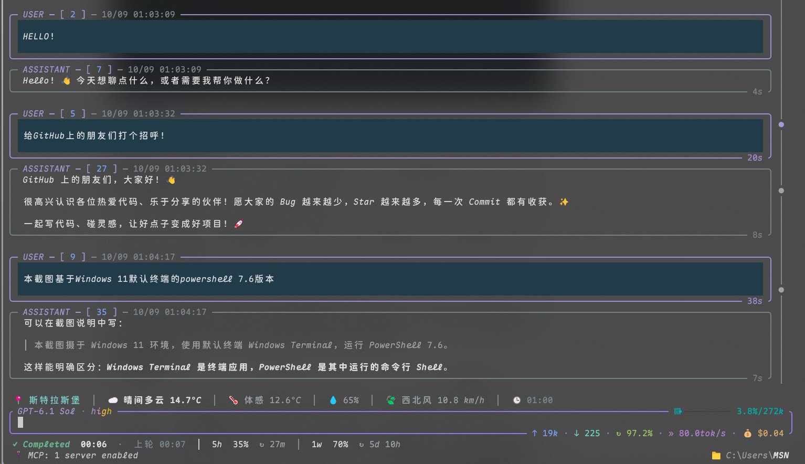
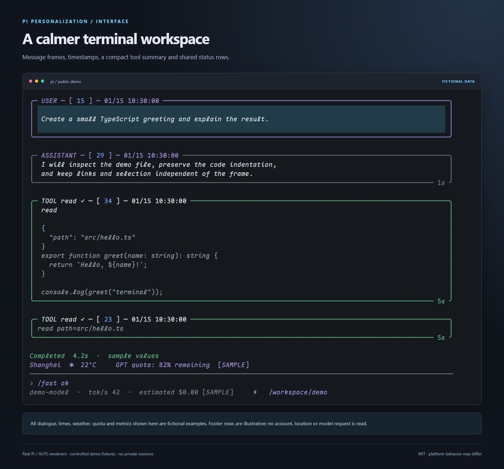
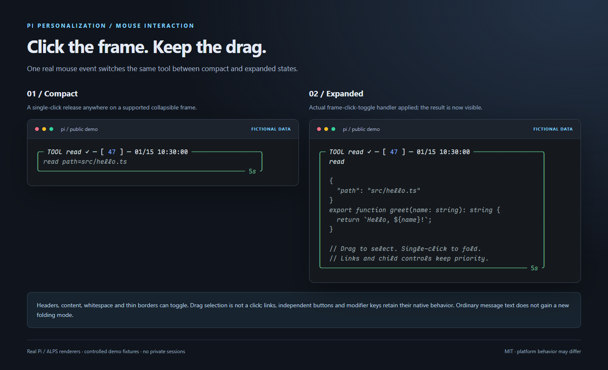
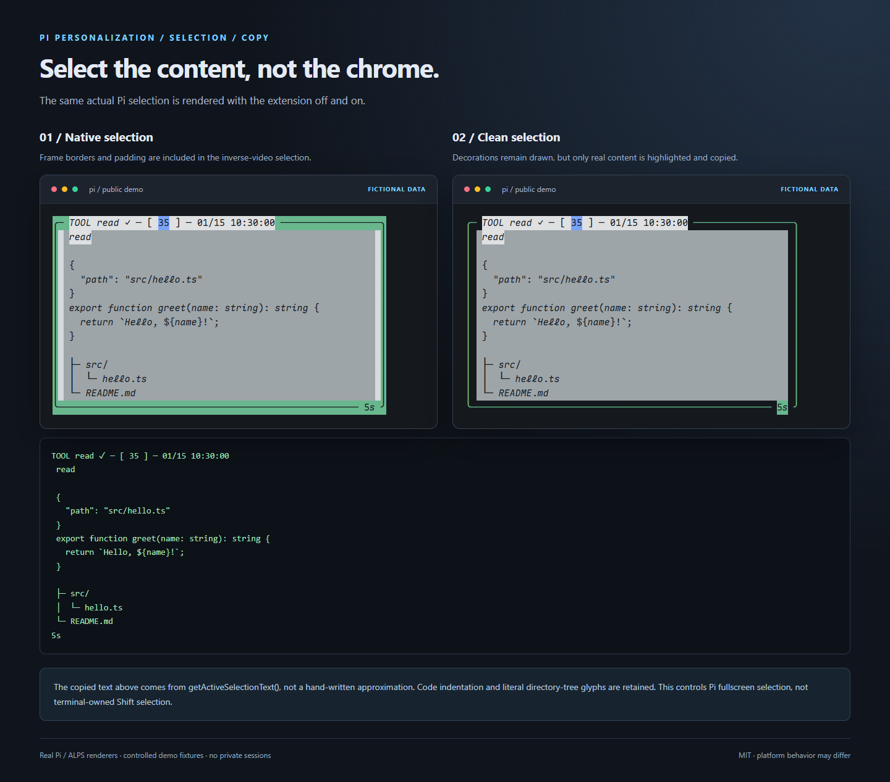

# Pi Personalization · 让终端里的 Pi 更顺手

[](https://github.com/Pasitearko/pi-personalization/actions/workflows/ci.yml)

[English](README.en.md) · [MIT](LICENSE) · [Skills / MCP 推荐](docs/RECOMMENDATIONS.md) · [安全说明](SECURITY.md)

把一套真实使用过的 Pi 外观定制整理成**可安装的 Pi package**：天气、订阅额度共享行、Fast 开关、会话时间戳、提问时间轴、整框展开/收缩，以及「框线不参与选区高亮和复制」。附带主题、字体构建配方、透明的 ALPS 高级补丁和可撤销的配置工具。

**这不是作者整台电脑的备份。** 不含账号、API keys、会话、MCP tokens、cookies、余额数据、CA 私钥、字体二进制或第三方游戏音效，也不会替换你的整份 Pi / 终端设置。

## 效果预览

这里包含作者提供的**实机截图**与单独制作的**演示预览**。实际终端效果会受字体和平台影响。

### 实机截图 · Windows 11



> 本截图摄于 Windows 11 环境，使用 Windows Terminal，运行 PowerShell 7.6。作者明确选择公开原图，未裁剪、未打码、未修改图片内容；这是实际终端截图，并非虚构数据演示。

### 演示预览 · 整体界面

下方三张图是**安全演示预览**：消息框由真实 Pi / ALPS 渲染器生成，展开与选区使用实际扩展逻辑；对话、目录、时间、天气、额度和指标均为虚构示例，状态栏为示意组合，不是私人会话或账户截图。



### 整框点击展开 / 收缩



### 干净选区与复制



[预览来源与隐私说明](docs/previews/README.md)

## 快速安装：基础包

前提：Node.js 22.19.0+（建议 24 LTS），已安装 Pi。建议使用 **Pi 1.1.0**；私有布局适配也保留对 1.0.4 的已验证支持。高级鼠标功能需要 Pi fullscreen 和支持 SGR mouse 的终端。

```sh
pi install git:github.com/Pasitearko/pi-personalization
```

重启 Pi 或执行 `/reload`。在 Pi 设置中选择 `no-tool-bg` 主题；如果不用本项目的主题，仍可保留你自己的主题。

也可以只对一个项目安装：

```sh
pi install -l git:github.com/Pasitearko/pi-personalization
```

**基础安装不会修改已安装 ALPS 的文件，不会自动装配套插件，不会默认开启 Fast，也不会导入别人的配置或认证。** 不使用 ALPS 时，依赖其边框/状态桥的部分会保持原生行为；独立功能仍可使用。

## 功能与命令

| 功能 | 行为 | 命令 / 依赖 |
|---|---|---|
| 天气 | 城市切换、15 分钟边界更新、缓存和错误退避；不自动定位 | `/weather`、`/weather next`；Open-Meteo |
| 订阅额度共享行 | 把上游额度状态放到独立行，避免和其他 footer 抢位置 | 需要 `@specode/pi-subscription-usage`；显示 used/remaining 遵循上游模式 |
| Working / Completed | 本轮计时和结果状态；不重建历史计时 | 自动；`/sound-test` 仅在 Windows 播放原创提示音 |
| Fast | OpenAI 请求增加 `service_tier=priority`；每个新会话默认关 | `/fast`、`/fast ok`、`/fast no` |
| 会话时间戳 | 在消息框标题保留消息产生的本地时间 | 自动；标题宽度不足时不挤坏正文 |
| 提问时间轴 | 右侧圆点定位到用户提问，可选择密集标记中的条目 | `/timeline`、`/timeline list`、`on/off/status` |
| 整框点击 | 已有可折叠框的标题、正文、空白和细线边框均可单击切换 | `/frame-clicks on/off/status`；需要支持的 ALPS 框 |
| 干净选区 / 复制 | 外框仍显示，但 ALPS 装饰线、额外边距不参与选区高亮/复制 | `/clean-copy on/off/status`；需要支持的 ALPS 框 |
| 简洁主题 | 减少工具输出背景块 | `no-tool-bg` |
| 高级 ALPS 定制 | Fast ⚡ / 文件夹路径布局、估算 cost、tok/s 持久化、状态缓存、隐藏上次 prompt echo、超链接适配 | 见下方；只对固定版本应用 |

Fast 图标表示**请求开关**，不是服务端已接受优先档位的证明，可能增加额度消耗。估算 cost 不是账单。余额由可选的 billion-context 插件和使用者自己的账号提供，本项目不附带账户/余额查询凭据。

### 天气位置

默认是公开示例城市：上海、斯特拉斯堡、东京，**不是用户住所**。无需 API key。按需用环境变量传入 1–5 个城市：

```sh
# macOS / Linux
export PI_WEATHER_LOCATIONS='[{"id":"london","name":"London","latitude":51.5074,"longitude":-0.1278}]'
```

```powershell
# PowerShell
$env:PI_WEATHER_LOCATIONS = '[{"id":"london","name":"London","latitude":51.5074,"longitude":-0.1278}]'
```

天气请求的坐标会发送给 Open-Meteo。当前天气数据时间统一采用 Asia/Shanghai，与城市所在地的昼夜标志分开处理；这是明确的显示约定，不会读取系统定位。重启 Pi 生效。公开默认位置只是示例，可自行更改。

### 鼠标规则

- 松开鼠标且没有拖动时，才触发单击展开/收缩；拖选不折叠。
- 链接和独立交互按钮优先。HTTP(S) 链接遵循终端 / Pi 链接行为；高级补丁中的 Windows 本地文件采用 Ctrl+左键，普通点击不打开文件。
- 只增强**本来就能折叠的框**，不会把所有 USER / ASSISTANT 正文变成新的折叠对象。
- 正文缩进、代码、表格、目录树、字面框线与选中的标题/时间/耗时保留；不会全局删除 `│` 等字符。
- 只选到装饰线时返回空选区，避免误复制最后一条回答。
- Ctrl/Alt/Shift 修饰点击不折叠；多击的首击仍可能切换，不承诺与双击单词选择同时成立。
- 本扩展只控制 **Pi fullscreen 的内部选区**；Shift 绕过 Pi、终端自身选区、SSH / tmux 转发与终端快捷键由终端管理。

## 高级外观：ALPS 配套与可撤销补丁

对普通用户，基础包即可。要复现作者的底部布局和超链接增强，再使用这一节。**先退出 Pi，并查看命令输出；更新第三方插件后不要盲目重放旧文件。**

```sh
pi install npm:alps-pi@0.3.4
pi install npm:@specode/pi-subscription-usage@1.3.1

git clone https://github.com/Pasitearko/pi-personalization.git
cd pi-personalization

# 只检查，不写入
node tools/setup.mjs
# 精确版本与源文件哈希检查全部通过后，主动应用高级补丁
node tools/setup.mjs --apply

# 可选：只补齐缺少的外观设置，已有设置不覆盖
node tools/setup.mjs --settings --apply
# 如果你明确想采用示例外观，可替换示例里出现的外观叶子字段
node tools/setup.mjs --settings --replace-settings --apply
```

再重启 Pi。工具默认读取 `PI_CODING_AGENT_DIR` 或 `~/.pi/agent`，第三方包默认定位在该目录的 `npm/node_modules`。自定义安装位置可指定 `--agent-dir /path/to/agent --modules /path/to/node_modules`。

补丁仅支持 **alps-pi 0.3.4 / @specode/pi-subscription-usage 1.3.1**，匹配 ALPS renderer 18 / cache v9；检查每个原文件和每个补丁文件的 SHA-256。未知版本、额外本地修改、symlink 路径或校验失败会拒绝覆盖。重复应用是幂等的；先保存 undo 再写入，失败时尝试回滚自己的写入。

撤回补丁（使用安装时打印的 receipt 路径）：

```sh
node tools/setup.mjs --undo /path/to/patch-undo.json --apply
```

撤回同样要求文件仍然等于本项目的已知补丁版本；不覆盖后来第三方更新的文件。设置另有本地原件备份，工具**不自动把旧整份 settings 覆盖回去**。配置工具不会设置账号、默认模型、providers、MCP 登录、个人目录或你的全局快捷键。

## 兼容性与限制

| 项目 | 范围 |
|---|---|
| Windows / macOS / Linux | Node 扩展与配置工具使用跨平台路径；系统功能按平台降级 |
| Pi | 推荐 1.1.0；整框/选区适配仅在验证列表 1.0.4 / 1.1.0 启用，其他版本保留原生行为 |
| 终端 | fullscreen、Unicode 与鼠标支持决定效果；ANSI/OSC8/字体由终端负责 |
| ALPS | 高级补丁固定 0.3.4；无 ALPS 时相关框线增强不生效 |
| 提示音 | Windows MCI；macOS/Linux 静默降级，计时状态正常 |
| 中文文件点击 | Windows 提供 Unicode opener；其他平台使用 Pi/终端原生行为，不保证 Windows 同样的 Ctrl-click 策略 |
| 字体 | 需要各系统自行安装；可选构建配方，不自动改系统字体/终端 profile |

这里的“跨平台”表示可安装、路径无机器绑定、支持不足会降级，**不表示任何终端都能提供完全相同的鼠标、链接或透明效果，也不保证未来私有 API 不变**。未知布局不会猜测边框：选区保持原生行为，优先避免损坏正文和选区。

## 字体与终端配置

可选字体配方见 [fonts/README.md](fonts/README.md)。它只把 A–Z/a–z 改为真斜体，数字、标点、中文、图标和框线保持直立；派生 family 是 `Studio Latin Italic NF CN`。字体数据遵守 **SIL OFL**，不因项目 MIT 而改变许可。

[Windows Terminal 示例](examples/windows-terminal.json) 仅含外观字段，请手工合并到 profile；没有个人 GUID、背景图、启动命令或键绑定。其他终端自行设置 font family、配色、透明度和超链接行为。

## Skills、MCP、其他插件

见 [推荐清单](docs/RECOMMENDATIONS.md)：find-skills、grilling、handoff、teach、Remotion、Playwright、Agent-Reach、imagegen，以及 GitHub MCP / pi-mcp-adapter。**只推荐，不自动安装全部，也不分发别人的认证或 skill 代码。**

## 开发、验证与升级

```sh
npm ci --ignore-scripts
npm test
npm run check:privacy
npm run package:check
```

测试启动器只对**本仓库 node_modules 中的开发依赖**应用同一组补丁，不碰你正在使用的 Pi。测试使用假的终端、音频启动器、网络响应与 clipboard；不调用模型、不查询真实额度、不打开浏览器。覆盖鼠标释放/拖选、细线框坐标、滚动/resize、Unicode 宽字符、链接、所有权/卸载、天气缓存和配置/补丁安全性。

本地 Windows 已通过 **232/232 项测试**。GitHub Actions 在 Windows / macOS / Linux 运行相同测试、隐私扫描与打包检查；状态以顶部 CI 徽章和 [运行记录](https://github.com/Pasitearko/pi-personalization/actions/workflows/ci.yml) 为准。另附 [CI 模板](docs/ci/github-actions.yml)。自动化不等于真实终端显示验收；终端差异仍须实测，也不能证明所有组合绝对无 bug。升级适配应先更新兼容性和测试，不能只把版本号检查删除。

目录结构：

```text
extensions/   八个独立扩展，以及原创 completion.wav
themes/       no-tool-bg 主题
patches/      固定版本源文件与 SHA-256 manifest
tools/        显式配置/补丁、测试与隐私检查工具
examples/     不含账号的外观配置示例
fonts/        可选字体构建配方与 OFL notice，无字体二进制
docs/         skills / MCP 推荐、三平台 CI 模板
licenses/     第三方原始 MIT notices
```

卸载基础包：`pi remove git:github.com/Pasitearko/pi-personalization`，再重启 Pi。若装了高级补丁，请先按上方 undo 撤回；配套插件和用户主动修改的设置不会被偷偷删除。请勿同时加载本项目与作者同名本地扩展副本，以免重复状态/重复 hook。

## License

本项目原创部分采用 **MIT**。ALPS / subscription-usage 修改文件保留上游 MIT notices；字体数据遵守 SIL OFL；推荐项目采用各自许可证。详情：[THIRD_PARTY_NOTICES.md](THIRD_PARTY_NOTICES.md)。
